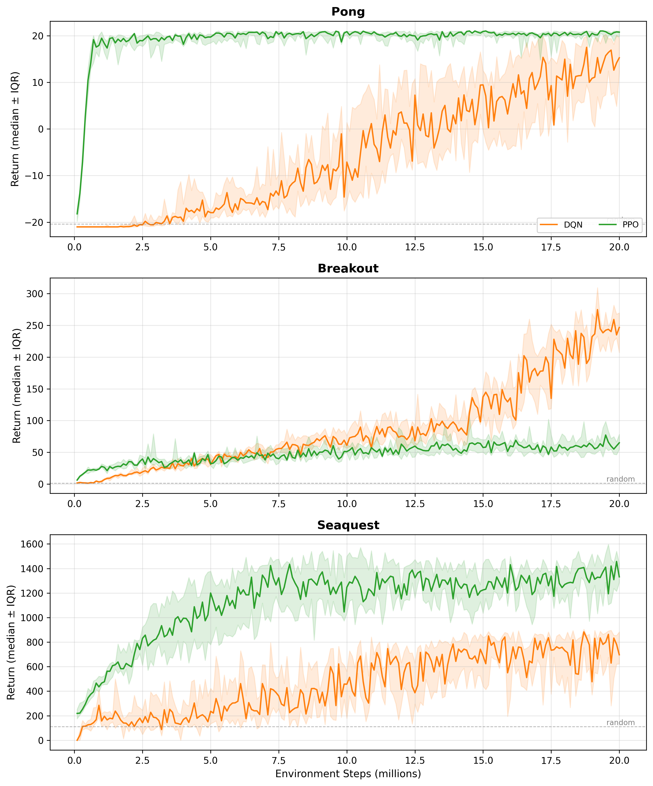
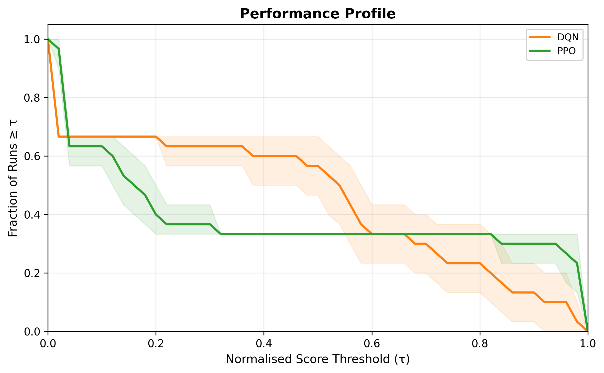
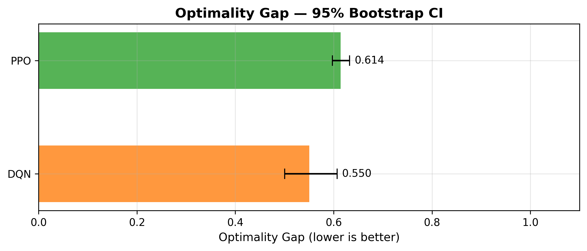
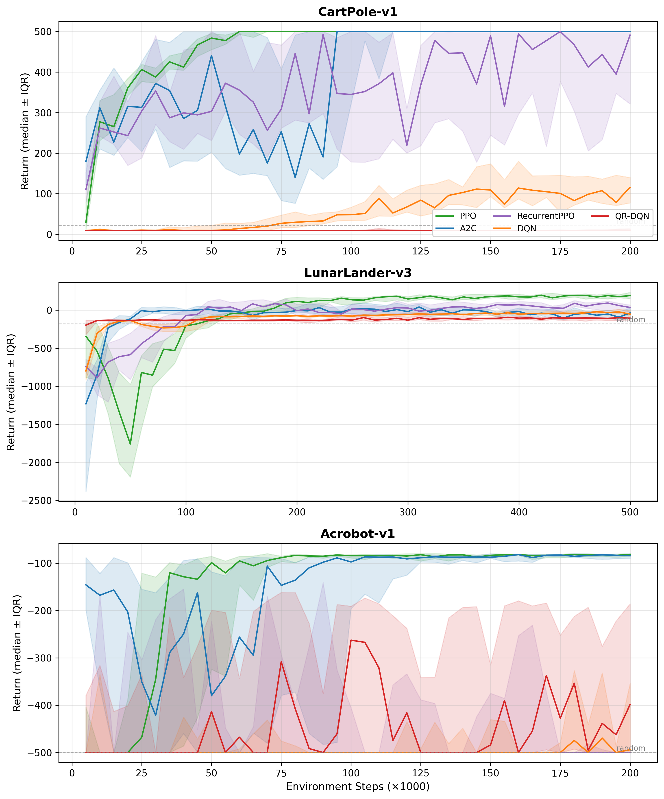

# FYP: Comparing Value-Based and Actor-Critic Deep RL Algorithms

Bachelor of Science in Computer Systems — University of Limerick, 2025–2026  
**Mykola Vaskevych**

---

## Overview

Three experiments comparing two families of deep reinforcement learning algorithms under identical conditions — same framework, same default hyperparameters, no per-algorithm tuning — so that observed differences reflect genuine algorithmic character rather than configuration effort.

**Algorithm families (all discrete action spaces):**
- Value-based: DQN, QR-DQN
- Actor-Critic: A2C, PPO, RecurrentPPO

**Environments:**
- Experiment 1 — Classic control: CartPole-v1, LunarLander-v3, Acrobot-v1
- Experiment 2 — Atari: Breakout, Pong, Seaquest (10M frames)
- Experiment 3 — Atari extended: same games, longer training budget

Statistical evaluation uses the [rliable](https://github.com/google-research/rliable) framework (Agarwal et al., 2021): IQM, bootstrap confidence intervals, performance profiles, optimality gap, and pairwise probability of improvement.

## Key Findings

- **PPO is the more reliable default** — consistent results across all settings, no special setup required
- **DQN is not weaker, it's more demanding** — matches or exceeds PPO on specific tasks given sufficient training time
- **Metrics can contradict each other**: IQM and pairwise P(X>Y), applied to the same data, point in opposite directions — a single aggregate number is insufficient for comparing RL algorithm families

## Results

### Atari — Learning Curves (DQN vs PPO vs A2C)


### Atari — Performance Profile (rliable)


### Atari — Optimality Gap


### Classic Control — Learning Curves


## Repository Structure

```
fyp/
├── rl_eval_bench/      # Experiment 1: classic control training + rliable evaluation pipeline
├── atari_bench/        # Experiments 2 & 3: Atari training pipeline
├── DQN_ATARY/          # Standalone DQN for Atari Breakout (with demo video)
├── paper_overleaf/     # LaTeX thesis source
└── experiment_3/       # Experiment 3 results
```

## Tech Stack

Python · Stable-Baselines3 · sb3-contrib · Gymnasium · rliable · PyTorch · marimo · uv

## Related Repos

- [DQN_ATARY](https://github.com/MykolaVaskevych/DQN_ATARY) — standalone DQN with Atari Breakout demo video
- [paper_overleaf](https://github.com/MykolaVaskevych/paper_overleaf) — full thesis PDF

## Run

```bash
uv sync

# Classic control: train all envs, evaluate, open report
cd rl_eval_bench
bash run.sh ppo        # or a2c, dqn, qrdqn, rppo

# DQN Breakout demo
cd DQN_ATARY
uv sync
uv run marimo edit notebook/CS4287-Assignment-2-Deep-Reinforcment-Learning.py
```
